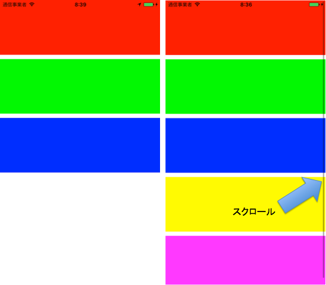
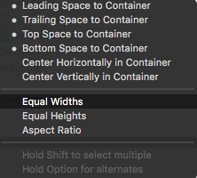

制約の修正なしで縦方向に要素を追加可能なビューの作成

## 概要
タイトルが長ったらしいですが、オートレイアウトでビューを組版している時、後から機能追加が発生し、「途中にビューを追加したい！」、「最後にビューを追加したい！」ってなると非常に面倒です。
そこで、Scroll ViewとStack Viewを組み合わせることで、AndroidでいうLinearLayoutっぽいものを実現できます。

## 構築手順
### 1.Scroll Viewの配置
基盤となるViewの全画面にScroll Viewを配置します。

Add New Constraintsで上下左右全てのマージンを0とします。

### 2.Stack Viewの配置
Scroll viewの子要素として、Vertical Stack Viewを配置します。
手順1と同様に、Add New Constraintsで上下左右全てのマージンを0とします。

しかし、このままではScroll Viewのコンテントサイズの制約がないためエラーがでます。

### 3.Scroll Viewコンテンツサイズの横幅の制約
Controlキーを押しながらStack Viewを選択し、Scroll Viewへドラッグします。

**Equla Widths** を選択し、Stack Viewの横幅をScroll Viewコンテントの横幅と揃える制約をつけます。

### 4.Scroll Viewコンテンツサイズの高さ（=Stack Viewの高さ）の制約
手順2により、Scroll Viewコンテンツサイズの高さ=Stack Viewの高さなため、Stack Viewの高さを決定します。様々なやり方があるのですが、ここでは、Stack Viewに配置されているビュー間のマージンが同じになるDistribution=Equal Spacingを例に取り説明します。

Stack Viewの子要素として適当なViewを追加します。
このViewの高さに制約を設けます。

Viewの高さが決定できると、Stack Viewの高さが決定でき、Scroll Viewのコンテンツサイズの高さが決まるため、エラーがなくなります。

以後、このStack Viewの子要素として、高さが決定しているViewを追加すれば、他のビューの制約を修正する必要はなくなります。

今回の例では、縦方向に要素を追加するサンプルについて説明しましたが、Horizontal Stack Viewを使えば同様の処理を横方向についても実現できます。

## サンプル
[Scroll-Stack-Content@github](https://github.com/ayakix/Scroll-Stack-Content)に動作するプロジェクトがあります。
