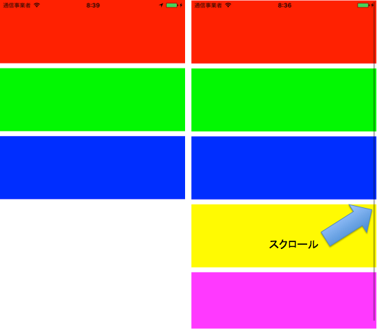

Creating views that can add elements vertically without modification of constraints
===========

# Overview
This is a sample program that create views that can add elements vertically without modification of constraints on Interface Builder.

## Author

**R. Ayakix**

- Past works: [Product list](http://ayakix.com/) / [Waaaaay!](http://waaaaay.com/)
- Blogs: [English](https://medium.com/@Ayakix) / [Japanese](http://blog.ayakix.com/)
- Contact: [Twitter](https://twitter.com/ayakix)

## Acknowledgements
- This tips was developed in [Snapmart](https://snapmart.jp/)
